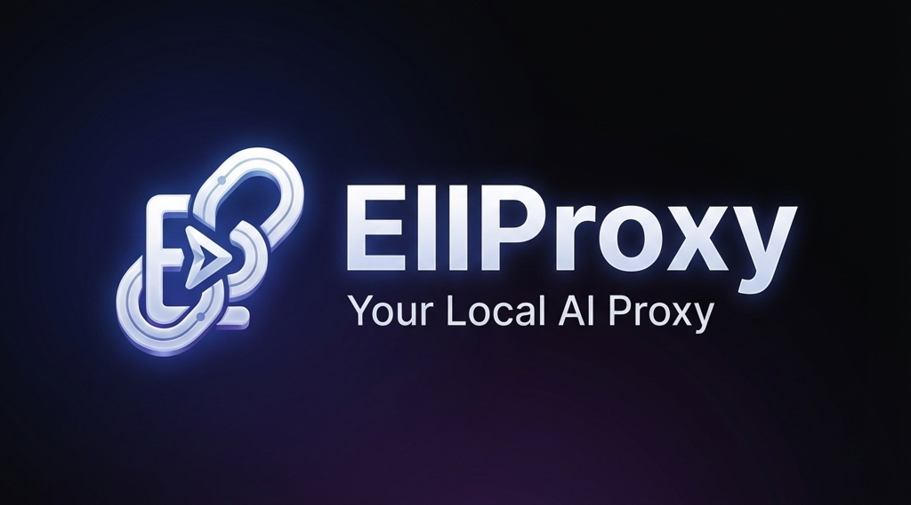

# Changelog

<div align="center">
  
</div>

> [!NOTE]

## [1.0.20] - 2026-01-15

### Updated
- **CLIProxyAPI 6.6.108-0** - Latest upstream release (#21)
  - Various upstream improvements and stability enhancements


## [1.0.19] - 2026-01-15

### Updated
- **CLIProxyAPI 6.6.105-0** - Latest upstream release (#20)
  - Various upstream improvements and stability enhancements


## [1.0.18] - 2026-01-13

### Updated
- **CLIProxyAPI 6.6.103-0** - Latest upstream release (#19)
  - Various upstream improvements and stability enhancements


## [1.0.17] - 2026-01-12

### Updated
- **CLIProxyAPI 6.6.100-0** - Latest upstream release (#18)
  - Various upstream improvements and stability enhancements


## [1.0.16] - 2026-01-10

### Updated
- **CLIProxyAPI 6.6.98-0** - Latest upstream release (#17)
  - Various upstream improvements and stability enhancements


## [1.0.15] - 2026-01-10

### Updated
- **CLIProxyAPI 6.6.96-0** - Latest upstream release (#16)
  - Various upstream improvements and stability enhancements


## [1.0.14] - 2026-01-09

### Updated
- **CLIProxyAPI 6.6.92-0** - Latest upstream release (#15)
  - Various upstream improvements and stability enhancements


## [1.0.13] - 2026-01-08

### Updated
- **CLIProxyAPI 6.6.91-0** - Latest upstream release (#14)
  - Various upstream improvements and stability enhancements


## [1.0.12] - 2026-01-07

### Updated
- **CLIProxyAPI 6.6.88-0** - Latest upstream release (#13)
  - Various upstream improvements and stability enhancements


## [1.0.11] - 2026-01-07

### Updated
- **CLIProxyAPI 6.6.86-0** - Latest upstream release (#12)
  - Various upstream improvements and stability enhancements


## [1.0.10] - 2026-01-05

### Updated
- **CLIProxyAPI 6.6.84-0** - Latest upstream release (#11)
  - Various upstream improvements and stability enhancements


## [1.0.9] - 2026-01-05

### Updated
- **CLIProxyAPI 6.6.83-0** - Latest upstream release (#10)
  - Various upstream improvements and stability enhancements


## [1.0.8] - 2026-01-04

### Updated
- **CLIProxyAPI 6.6.82-0** - Latest upstream release (#9)
  - Various upstream improvements and stability enhancements


## [1.0.7] - 2026-01-04

### Updated
- **CLIProxyAPI 6.6.81-0** - Latest upstream release (#8)
  - Various upstream improvements and stability enhancements


## [1.0.6] - 2026-01-03

### Updated
- **CLIProxyAPI 6.6.80-0** - Latest upstream release (#7)
  - Various upstream improvements and stability enhancements


## [1.0.5] - 2026-01-02

### Updated
- **CLIProxyAPI 6.6.77-1** - Latest upstream release (#6)
  - Various upstream improvements and stability enhancements


## [1.0.4] - 2025-12-31

### Updated
- **CLIProxyAPI 6.6.73-0** - Latest upstream release (#4)
  - Various upstream improvements and stability enhancements


## [1.0.3] - 2025-12-31

### Updated
- **CLIProxyAPI 6.6.71-0** - Latest upstream release (#3)
  - Various upstream improvements and stability enhancements


## [1.0.2] - 2025-12-30

### Updated
- **CLIProxyAPI 6.6.69-0** - Latest upstream release (#2)
  - Various upstream improvements and stability enhancements


## [1.0.1] - 2025-12-30

### Updated
- **CLIProxyAPI 6.6.68-0** - Latest upstream release (#1)
  - Various upstream improvements and stability enhancements

> **Forked from [VibeProxy v1.8.23](https://github.com/automazeio/vibeproxy)**
> 
> This CHANGELOG documents **EllProxy-specific changes and enhancements** only.
> For the original VibeProxy v1.8.23 features and history, see the [upstream repository](https://github.com/automazeio/vibeproxy/releases/tag/v1.8.23).

All notable changes to **EllProxy** are documented here.

This project adheres to [Semantic Versioning](https://semver.org/spec/v2.0.0.html).

---

## [Unreleased]

### 🎯 EllProxy vs VibeProxy v1.8.23 - What's Different?

EllProxy is a complete architectural overhaul of VibeProxy v1.8.23. Here's what makes it unique:

### 🏗️ **Modular Architecture** (NEW)

**VibeProxy v1.8.23:**
```
src/Sources/
├── AppDelegate.swift (12KB monolithic)
├── ServerManager.swift (20KB)
├── ThinkingProxy.swift (33KB)
├── SettingsView.swift (23KB)
└── [6 other files]
```

**EllProxy:**
```
src/Sources/
├── App/ (Application lifecycle)
├── Services/ (6 service modules)
├── Views/ (5 view components)
├── ThinkingProxy/ (9 modular files)
├── QuickSetup/ (10 setup modules)
├── Models/ (Data models)
├── Config/ (Configuration)
├── ServerManagement/ (2 management modules)
└── Resources/
    └── models/ (Provider model JSONs) ← NEW
```

#### Changes:
- **50+ files vs 10 files** - Better separation of concerns
- **12 modules** - App, Services, Views, ThinkingProxy, QuickSetup, Models, Config, ServerManagement, Settings, Resources + 2 more
- **10KB average file size** vs 20-30KB monolithic files
- **Easier navigation** - Logical component grouping

---

### 🎯 **Model Management System** (FEATURE NEW TO ELLPROXY)

**VibeProxy v1.8.23:** No model management interface

**EllProxy Features:**
- ✅ **ModelSyncService.swift** - Automatic model discovery from providers
- ✅ **DiscoveredModelsStore.swift** - Persistent model storage
- ✅ **ModelRouter.swift** - Routing logic for model requests
- ✅ **ModelsView.swift** - Dedicated UI for model management
- ✅ **Provider-based JSON files** - `claude.json`, `google.json`, `copilot.json`, etc.
- ✅ **Fallback Model Selection** - Configure backup models
- ✅ **Default Model Configuration** - Set defaults per provider
- ✅ **Model Search Interface** - Find models quickly
- ✅ **Add Model Manually** - `AddModelView.swift` for custom additions

#### Implementation Details:
```swift
// NEW: Resources/models/
models/
├── antigravity.json
├── claude.json
├── codex.json
├── copilot.json
├── google.json
├── iflow.json
└── qwen.json
```

---

### 🔧 **Enhanced ThinkingProxy** (MAJOR REFACTOR)

**VibeProxy v1.8.23:** Single 33KB `ThinkingProxy.swift` file

**EllProxy Modular Structure:**
```
ThinkingProxy/
├── Core/
│   ├── ThinkingConfig.swift         # Configuration
│   ├── ThinkingProxyProtocols.swift # Protocols
│   └── ThinkingProxyTypes.swift     # Type definitions
├── Processing/
│   └── ThinkingProcessor.swift      # Parameter processing
├── ThinkingProxy.swift              # Main implementation (streamlined)
├── ThinkingProxy+Anthropic.swift    # Claude-specific logic
├── ThinkingProxy+Connection.swift   # Connection management
├── ThinkingProxy+DeepSeekFixes.swift # DeepSeek compatibility
├── ThinkingProxy+Forwarding.swift   # Request forwarding
├── ThinkingProxy+ImageNormalization.swift # Image handling
├── ThinkingProxy+PayloadFixes.swift # Payload corrections
├── ThinkingProxy+Response.swift     # Response handling
├── ThinkingProxy+ThinkingMode.swift # Thinking mode logic
└── ReasoningCache.swift             # Response caching ← NEW
```

#### Benefits:
- **9 focused files** vs 1 monolithic file
- **Reasoning cache** for performance
- **Provider-specific modules** for better compatibility
- **Extension-based organization** - Easy to add new providers
- **Testable components** - Each module can be tested independently

---

### 🚀 **Automated Release System** (FEATURE NEW TO ELLPROXY)

**VibeProxy v1.8.23:** Manual builds with Apple Developer account required

**EllProxy Automation:**

#### New Scripts:
1. **`clean_and_prepare.sh`** (NEW)
   - Cleans development artifacts
   - Audits `config.yaml` for sensitive keys
   - Auto-updates CLIProxyAPIPlus binary
   - Triggers fresh production build

2. **`scripts/update_binary.sh`** (NEW)
   - Fetches latest CLIProxyAPIPlus from GitHub
   - Validates darwin_arm64 architecture
   - Auto-installs to `src/Sources/Resources/`

3. **`scripts/sync_thinking_support.sh`** (RENAMED)
   - Previously: `test_thinking_support1.sh`
   - Optimized for in-app model sync (no summary table)

#### CI/CD Workflows:
- **`.github/workflows/update-cliproxyapi.yml`** - Auto-detect upstream updates
- **`.github/workflows/auto-release.yml`** - Merge PRs and bump versions
- **`.github/workflows/release.yml`** (MODIFIED) - Unsigned builds for users without Apple Developer accounts

#### Changes to `release.yml`:
```yaml
# REMOVED (requires Apple Developer):
- Code signing with Developer ID
- Notarization by Apple
- Sparkle signature generation

# KEPT (works without account):
- Build EllProxy.app
- Create EllProxy.zip  
- Create EllProxy.dmg
- Upload to GitHub Releases
```

---

### 🎨 **UI/UX Improvements**

#### Sync Terminology Rebranding
**VibeProxy v1.8.23:** "Testing" terminology  
**EllProxy:** "Sync" terminology throughout

**Files Changed:**
- `ModelSyncService.swift`:
  - UI labels: "Testing" → "Sync"
  - Status messages consistently use "Sync"
  
#### Enhanced Notifications
**VibeProxy v1.8.23:** Generic notifications  
**EllProxy:** Provider context included

**Example:**
```
VibeProxy: "Testing model: gemini-1.5-pro"
EllProxy:  "Syncing AntiGravity: gemini-1.5-pro"
```

**Implementation:**
- Added `X-EllProxy-Provider` header to sync requests
- Modified `ThinkingProxy+ThinkingMode.swift` to extract provider
- Updated notification messages with provider names

---

### 🛠️ **Project Organization**

#### New Directory Structure:

**Services Subfolder (NEW):**
```
services/
└── trae-proxy/
    ├── trae_proxy.py
    ├── config.yaml
    ├── generate_certs.py
    └── requirements.txt
```

**Scripts Consolidation (NEW):**
```
scripts/
├── sync_thinking_support.sh    # For in-app sync
├── update_binary.sh            # Binary auto-update
└── dev-tools/                  # Git ignored
    ├── create-release.sh
    ├── test_*.sh              # 7 test scripts
    └── run_*.sh               # Development runners
```

**VibeProxy v1.8.23:** All scripts in root directory  
**EllProxy:** Organized in `scripts/` with dev-tools isolated

---

### 📦 **Build System Enhancements**

#### Updated `.gitignore`:
```
# NEW: AI agent metadata (ignored)
.agent/
.claude/
.gemini/
.antigravity/

# UPDATED: Trae-Proxy certificates path
services/trae-proxy/ca/

# NEW: Dev tools isolation
scripts/dev-tools/
```

#### Updated Build Paths:
- `create-app-bundle.sh`: `TRAE_PROXY_SRC=services/trae-proxy`
- `ModelSyncService.swift`: Development fallback → `scripts/sync_thinking_support.sh`

---

### 🔐 **Security Enhancements**

#### Automated Audits (NEW):
`clean_and_prepare.sh` includes:
```bash
# Audit config.yaml for sensitive keys
if grep -q "sk-" src/Sources/App/Config/config.yaml; then
  echo "❌ Found OpenAI API key in config.yaml!"
  exit 1
fi
```

#### `.gitignore` Improvements:
- AI agent metadata folders excluded
- Development tools not committed
- Trae-Proxy CA certificates protected

---

## [1.0.0-beta] - TBD

### Initial Beta Release

**Base:** VibeProxy v1.8.23  
**Binary:** CLIProxyAPIPlus v6.6.63-0

### Inherited Features from VibeProxy v1.8.23:
- ✅ Native macOS menu bar application
- ✅ Multi-provider OAuth (Claude, Codex, Gemini, Qwen, Antigravity, GitHub Copilot)
- ✅ Extended thinking support for Claude models
- ✅ Multi-account management with auto-failover
- ✅ Real-time status monitoring
- ✅ Launch at login

### EllProxy Exclusive Features:
- ✅ Modular architecture (50+ files, 12 modules)
- ✅ Model Management System (discovery, sync, search, fallback)
- ✅ Enhanced ThinkingProxy (9 modular files with caching)
- ✅ Automated release workflows (unsigned builds)
- ✅ Provider names in notifications
- ✅ Trae-Proxy service integration
- ✅ Consolidated scripts directory
- ✅ Security audits in build process

### Known Limitations:
- ⚠️ **Ad-hoc signature only** - Users must right-click → Open on first launch
- ⚠️ **Sparkle auto-update disabled** - Requires manual download for updates
- ⚠️ **No notarization** - macOS Gatekeeper warnings expected

### Requirements:
- macOS 14.0 (Sonoma) or later
- Apple Silicon (M1/M2/M3/M4)

---

## Future Releases

Planned improvements:
- [ ] Apple Developer signing (when account available)
- [ ] Additional model providers
- [ ] Enhanced QuickSetup handlers
- [ ] Performance optimizations

---

[Unreleased]: https://github.com/ellfarnaz/ellproxy/compare/v1.0.0-beta...HEAD
[1.0.0-beta]: https://github.com/ellfarnaz/ellproxy/releases/tag/v1.0.0-beta
