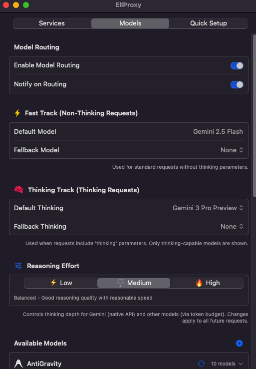
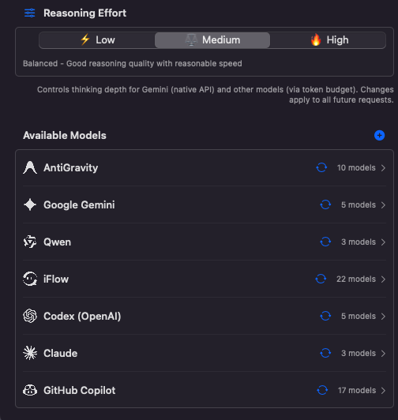
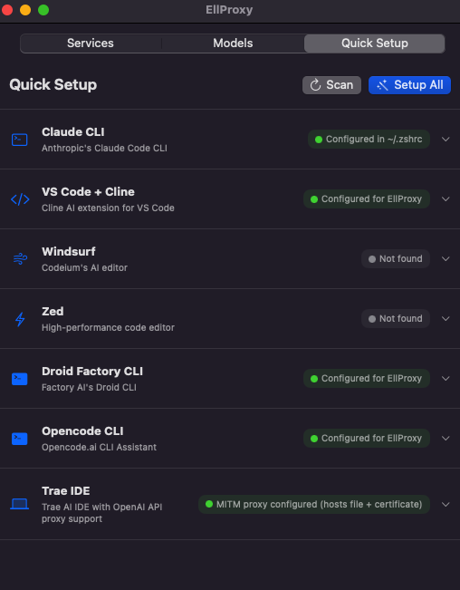
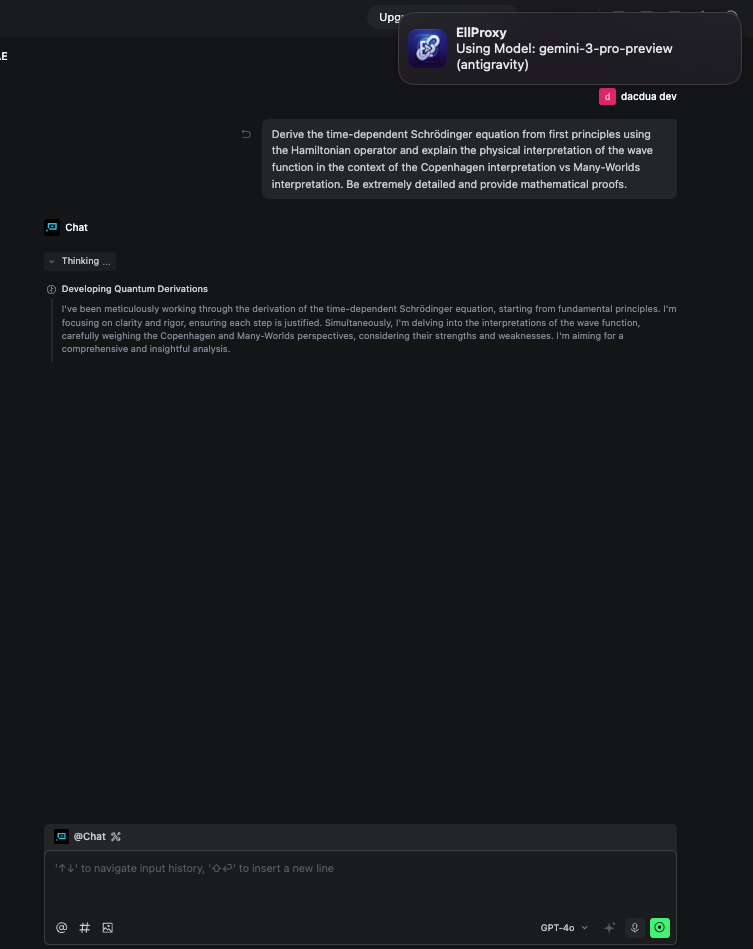
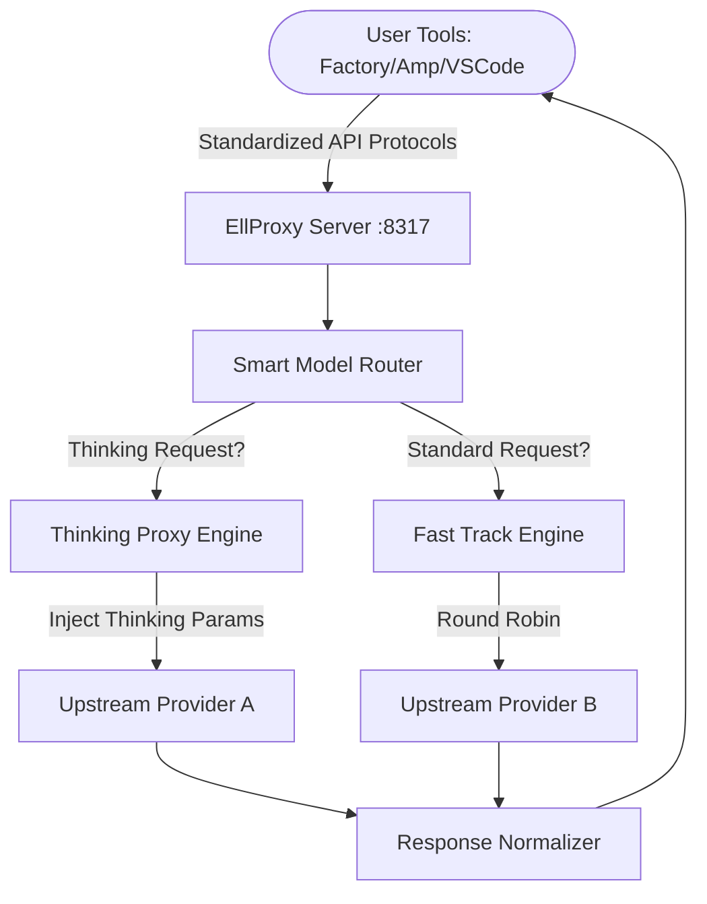

# EllProxy 🚀
> Ultra-Performance AI Dispatch Gateway for macOS (v1.0.0-beta)

<div align="center">
  

  <h3>Your Personal High-Performance AI Dispatch Gateway</h3>
  <p>Seamlessly proxy Gemini & Claude. OpenAI-Compatible. Privacy First.</p>
  
  <p>
    <a href="https://github.com/ellfarnaz/ellproxy/releases">
      
    </a>
    
    
    
  </p>

  <p>
    <a href="#-features">Features</a> • 
    <a href="#-gui-overview">GUI Overview</a> • 
    <a href="#-architecture">Architecture</a> • 
    <a href="#-installation">Installation</a> • 
    <a href="#-integration">Integration</a>
  </p>

  <p>
    <a href="USER_GUIDE.md">User Guide</a> | 
    <a href="CONTRIBUTING.md">Contributing</a> |
    <a href="CHANGELOG.md">Changelog</a>
  </p>
</div>

---

**EllProxy** is a next-generation native macOS menu bar application designed for developers and AI enthusiasts. It perfectly combines multi-account management, protocol conversion, and smart request scheduling to provide you with a stable, high-speed, and low-cost **Local AI Relay Station**.

By leveraging this app, you can transform common AI subscriptions (Claude, Gemini, etc.) into standardized API interfaces, enabling you to use powerful tools like **Factory Droids**, **AmpCode**, and **Trae** without purchasing separate API credits.

> [!NOTE]
> **Forked from [VibeProxy](https://github.com/automazeio/vibeproxy) v1.8.23** — Enhanced with modular architecture, advanced model management, and automated release workflows.

## 🌟 Detailed Feature Matrix

### 1. 🎛️ Smart Menu Bar Dashboard
*   **Global Status Monitoring**: Instant insight into server health, active port, and connection status directly from your menu bar.
*   **One-Click Control**: Toggle "Smart Routing" and "Thinking Mode" instantly without digging through menus.
*   **Non-intrusive Design**: Runs silently in the background with a minimal memory footprint, optimized for Apple Silicon (M1-M4).

### 2. 🔐 Seamless Provider Integration
*   **Unified Auth System**: Supports **Google (Gemini)**, **Anthropic (Claude)**, **OpenAI (ChatGPT)**, **Qwen**, and **Antigravity** accounts.
*   **Multi-Account Round-Robin**: Automatically rotates between multiple accounts for the same provider to maximize rate limits.
*   **Secure Storage**: All credentials are encrypted and stored safely in the macOS Keychain.

### 3. 🔄 Universal API Gateway
*   **OpenAI Compatible**: Provides a standardized `/v1/chat/completions` endpoint compatible with 99% of AI tools (VS Code extensions, terminal agents).
*   **Anthropic Compatible**: Fully supports the new `thinking` capability in **Claude Code CLI**, enabling extended reasoning models like `claude-4-5-sonnet-thinking`.
*   **Coding Agent Ready**: Dedicated support for **Factory Droids** and **Amp CLI**, transforming them into infinite-context coding machines.

### 4. 🔀 Intelligent Model Routing
*   **Fast Track vs Thinking Track**: Automatically routes standard requests to fast models (e.g., Gemini Flash) and reasoning requests to powerful models (e.g., Claude Opus/Sonnet Thinking).
*   **Auto-Failover**: Smartly detects failures and redirects requests to your configured backup models, ensuring your coding flow never stops.
*   **Model Sync**: One-click discovery of all available models from your connected providers.

## 🖥️ GUI Overview

<div align="center">
  <table>
    <tr>
      <td align="center">
        
        <br><b>Smart Model Routing</b><br>Configure default and fallback models with precision.
      </td>
      <td align="center">
        
        <br><b>Model Management</b><br>Sync and manage discovered models effortlessly.
      </td>
    </tr>
     <tr>
      <td align="center">
        
        <br><b>Quick Setup</b><br>Auto-configure your favorite tools in seconds.
      </td>
      <td align="center">
        
        <br><b>Advanced Details</b><br>Deep dive into model capabilities.
      </td>
    </tr>
  </table>
</div>

## 🏗️ Architecture



## 📥 Installation

### Option A: Pre-built Release
Download from [GitHub Releases](https://github.com/ellfarnaz/ellproxy/releases):
1. Download `EllProxy.zip` or `EllProxy.dmg`.
2. Extract and drag to `/Applications`.
3. **First Launch**: Right-click → Open (to bypass gatekeeper for unsigned app).

### Option B: Build from Source
```bash
git clone https://github.com/ellfarnaz/ellproxy.git
cd ellproxy
./create-app-bundle.sh
```

## 🔌 Quick Integration

### Factory Droids
Add to `~/.factory/config.json`:
```json
{
  "custom_models": [
    {
      "model": "ellproxy-default",
      "base_url": "http://localhost:8317/v1",
      "api_key": "dummy",
      "provider": "openai"
    }
  ]
}
```

### Amp CLI
Configure Amp to use local proxy:
```bash
# Set Amp to use EllProxy
amp config set url http://localhost:8317
```

### Python / OpenAI SDK
```python
from openai import OpenAI

client = OpenAI(
    base_url="http://localhost:8317/v1",
    api_key="dummy-key"
)

response = client.chat.completions.create(
    model="gemini-2.0-flash",
    messages=[{"role": "user", "content": "Hello via EllProxy!"}]
)
print(response.choices[0].message.content)
```

## 📝 Developer & Community

*   **License**: **MIT**. Open source and free.
*   **Privacy**: All data runs locally. No data collection.

---

<div align="center">
  <p>If you find this tool helpful, please give it a ⭐️ on GitHub!</p>
  <p>Copyright © 2025 EllProxy Team.</p>
</div>
