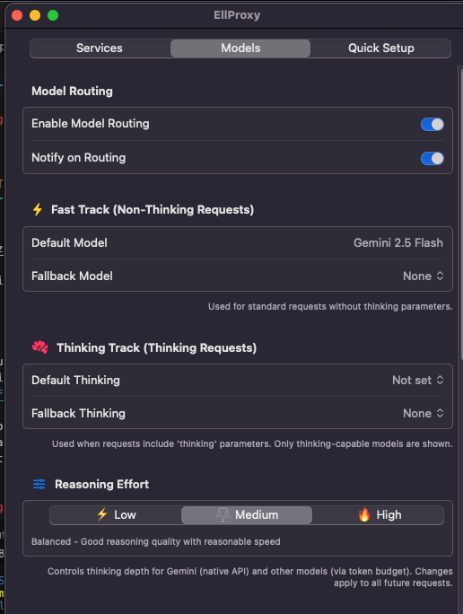
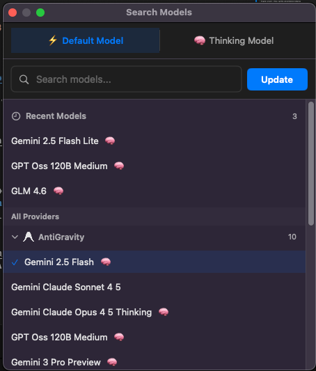
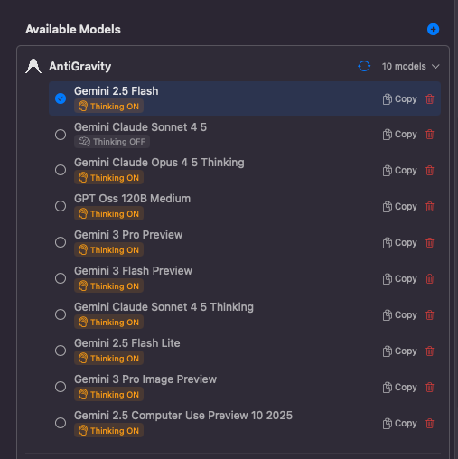
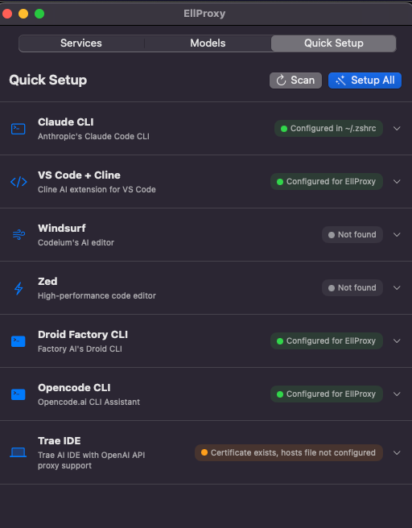
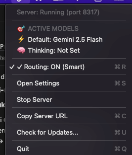

# EllProxy User Guide

Welcome to EllProxy! This guide will help you understand and use all features of the application.

---

## Table of Contents

1. [Getting Started](#getting-started)
2. [Services Tab](#services-tab)
3. [Models Tab](#models-tab)
   - [Model Routing](#model-routing)
   - [Fast Track (Non-Thinking)](#fast-track-non-thinking-requests)
   - [Thinking Track](#thinking-track-thinking-requests)
   - [Reasoning Effort](#reasoning-effort)
   - [Model Search](#model-search)
   - [Available Models](#available-models)
4. [Quick Setup Tab](#quick-setup-tab)
5. [Menu Bar Controls](#menu-bar-controls)
6. [Model Synchronization (Sync)](#model-synchronization-sync)
7. [Troubleshooting](#troubleshooting)

---

## Getting Started

EllProxy is a macOS menu bar application that acts as a proxy for AI coding tools, allowing you to use your existing AI subscriptions (Claude, Gemini, GPT, etc.) with tools like Factory Droids, Cline, Windsurf, and more.

### First Launch

1. Open **EllProxy** from your Applications folder
2. Look for the EllProxy icon in your menu bar (top-right of screen)
3. Click the icon → **Open Settings**
4. The proxy server starts automatically on port `8317`

---

## Services Tab

The **Services** tab is where you manage OAuth connections to AI providers.

### Supported Providers
- **Claude Code** (Anthropic)
- **Codex** (OpenAI)
- **Gemini** (Google)
- **Qwen** (Alibaba)
- **AntiGravity** (Google's unified AI service)
- **GitHub Copilot**
- **iFlow**
- **Kiro**

### Connecting a Provider

1. Click **"Connect"** next to a provider
2. Your browser opens for OAuth authentication
3. Complete the authentication process
4. EllProxy automatically detects your credentials
5. Status changes to **"Connected"** with email and expiration date

### Multi-Account Support

You can connect **multiple accounts** per provider:
- Accounts are used in **round-robin** distribution
- **Auto-failover** when an account hits rate limits
- Click **"Add Account"** to connect additional accounts
- Click **"Remove"** to disconnect individual accounts

---

## Models Tab

The **Models** tab is the heart of EllProxy's intelligent routing system.

### Model Routing

**Enable Model Routing** toggle:
- **ON (Blue)**: EllProxy actively routes requests to configured default/fallback models
- **OFF**: Routing disabled, requests pass through unchanged

**Notify on Routing** toggle:
- **ON (Blue)**: macOS notification when a model is substituted
- **OFF**: Silent routing

> **💡 Tip**: Enable "Notify on Routing" to see when EllProxy is actively routing requests. This helps you understand which models are being used.

---

### Fast Track (Non-Thinking Requests)

Used for **standard AI requests** without extended reasoning.

#### Default Model
The primary model used for non-thinking requests.

**Example**: `Gemini 2.5 Flash`

When a tool requests a model without thinking parameters, EllProxy uses this default.

#### Fallback Model
Used when the default model is unavailable (rate limit, error, etc.).

**Options**:
- **None**: No fallback, requests fail if default unavailable
- **[Any Model]**: Select a backup model

> **⚡ Use Case**: Set a fast, affordable model (like Gemini 2.5 Flash) as default, with a more powerful model (like Claude Sonnet) as fallback for important tasks.

---

### Thinking Track (Thinking Requests)

Used when requests include **thinking/reasoning parameters** (extended reasoning mode).

#### Default Thinking
The primary model for thinking-enabled requests.

**Options**:
- **Not set**: No default thinking model
- **[Thinking-capable model]**: e.g., Claude Opus 4.5 Thinking

Only **thinking-capable models** appear in this list (models with 🧠 icon).

#### Fallback Thinking
Backup model for thinking requests if default thinking model fails.

> **🧠 Important**: Only models with **"Thinking: ON"** capability can be used for thinking track. Regular models cannot handle extended reasoning.

---

### Reasoning Effort

Controls the **thinking depth** for reasoning-capable models.

#### Levels:
- **⚡ Low**: Fast responses, basic reasoning
- **⚖️ Medium**: Balanced quality and speed (recommended)
- **🔥 High**: Deep reasoning, slower but more thorough

#### What it Does:
- **For Gemini (native API)**: Directly sets thinking effort
- **For other models**: Controls thinking token budget
- **Applies to**: All future requests with thinking enabled

> **⚖️ Recommendation**: Start with "Medium" for most tasks. Use "High" for complex coding problems, debugging, or architecture decisions.

---

### Model Search

Click the **search icon** (🔍) in toolbar to open Model Search.

#### Two Tabs:

**⚡ Default Model**
- Search and select your default non-thinking model
- Shows recently used models at top
- Organized by provider

**🧠 Thinking Model**
- Search thinking-capable models
- Only models with thinking support (🧠 icon) shown

#### Features:
- **Search bar**: Type to filter models
- **Recent Models**: Quick access to frequently used
- **Provider grouping**: Models organized by AI provider
- **Update button**: Apply selected model

---

### Available Models

View all discovered models with details.

#### Information Shown:
- **Model name**: Full identifier (e.g., "Gemini 2.5 Flash")
- **🧠 Thinking ON/OFF**: Indicates reasoning capability
- **Provider**: Which AI service provides this model
- **Copy button**: Copy model name to clipboard
- **Delete button**: Remove model from list

#### Model Status Indicators:
- **🧠 Thinking ON** (orange): Supports extended reasoning
- **⚪ Thinking OFF** (gray): Standard model, no reasoning

#### Actions:
- **Copy**: Click copy icon to get exact model name for configs
- **Delete**: Remove outdated or unwanted models
- **Sync**: Click "Sync Models" to refresh the list

---

## Quick Setup Tab

Automatically configures AI coding tools to use EllProxy.

### Supported Tools

#### ✅ Configured for EllProxy (Green)
- **Claude CLI**: Anthropic's official CLI
- **VS Code + Cline**: Cline AI extension
- **Droid Factory CLI**: Factory AI Droids
- **Opencode CLI**: Opencode assistant

#### ⚠️ Partially Configured (Orange)
- **Trae IDE**: Certificate exists, hosts file needs update

#### ⚪ Not Found (Gray)
- **Windsurf**: Not installed
- **Zed**: Not installed

### Using Quick Setup

**Scan Button**: 
- Click to detect installed tools
- Updates configuration status

**Setup All Button**:
- One-click configuration for all detected tools
- Creates/updates config files
- Sets proxy URL to `http://localhost:8317`
- Configures SSL certificates (if needed)

**Individual Tool Setup**:
- Click dropdown (▼) on each tool
- See detailed setup status
- Manual setup instructions

### What Setup Does

For each tool, Quick Setup:
1. **Detects** installation location
2. **Creates/updates** configuration files
3. **Sets** proxy URL to EllProxy
4. **Installs** SSL certificates (for tools that need MITM support)
5. **Updates** shell RC files (`.zshrc`, `.bashrc`) if needed

> **🔒 Security Note**: SSL certificate installation requires sudo password. EllProxy explains what it's doing before requesting elevated access.

---

## Menu Bar Controls

Click the EllProxy icon in your menu bar to access quick controls.

### Status Information

**Server Status**:
- **Server: Running (port 8317)**: Proxy is active
- **Server: Stopped**: Proxy is inactive

**Active Models**:
- **⚡ Default**: Currently configured fast-track model
- **🧠 Thinking**: Currently configured thinking model
- **Not Set**: No model configured

**Routing Status**:
- **✓ Routing: ON (Smart)**: Intelligent routing enabled
- **Routing: OFF**: Pass-through mode

### Menu Options

- **⌘R Routing: ON/OFF**: Toggle model routing
- **⌘S Open Settings**: Open full settings window
- **Stop Server**: Shut down proxy server
- **⌘C Copy Server URL**: Copy `http://localhost:8317`
- **⌘U Check for Updates**: Manual update check
- **⌘Q Quit**: Exit EllProxy

### Keyboard Shortcuts

| Shortcut | Action |
|----------|--------|
| `⌘R` | Toggle Routing |
| `⌘S` | Open Settings |
| `⌘C` | Copy Server URL |
| `⌘U` | Check Updates |
| `⌘Q` | Quit |

---

## Model Synchronization (Sync)

**Sync** is EllProxy's model discovery feature.

### What is Sync?

Syncing **tests each provider** to discover:
1. Which models are available
2. Which models support thinking/reasoning
3. Model capabilities and limitations

### How to Sync

**From Models Tab**:
1. Click **"Sync Models"** button (top-right)
2. EllProxy sends test requests to all connected providers
3. Progress shown in notifications:
   - "Syncing AntiGravity: gemini-1.5-pro"
   - "Syncing Claude: claude-opus-4-5"
4. Newly discovered models appear in "Available Models"

### When to Sync

- **First time** after connecting a provider
- **After provider updates** (new models released)
- **If models missing** from search/dropdown
- **Monthly** to keep model list fresh

### Sync vs Testing

EllProxy renamed "Testing" to "Sync" for clarity:
- **Old terminology**: "Testing models..."
- **New terminology**: "Syncing models..."

Both refer to the same model discovery process.

> **📡 Note**: Sync requires active internet and valid provider credentials. Each sync request uses a small amount of your API quota.

---

## Troubleshooting

### Routing Not Working

**Problem**: Requests not using default model

**Solutions**:
1. Check **"Enable Model Routing"** is ON (blue)
2. Verify **default model is set** (not "Not set")
3. Ensure **server is running** (menu bar shows "Running")
4. Try **toggling routing OFF then ON**

---

### Models Not Appearing

**Problem**: Expected models don't show in dropdown

**Solutions**:
1. Click **"Sync Models"** to refresh
2. Check **provider is connected** (Services tab)
3. Verify **credentials not expired**
4. Wait 1-2 minutes for sync to complete

---

### Tool Configuration Failed

**Problem**: Quick Setup shows "Not configured"

**Solutions**:
1. Click **"Scan"** to re-detect tools
2. Check tool is **actually installed**
3. Try **manual setup** (expand dropdown for instructions)
4. For certificate issues, try **"Setup All"** with sudo

---

### Connection Errors

**Problem**: "Could not connect to server"

**Solutions**:
1. Check **server is running** (menu bar)
2. Verify **port 8317 not blocked** by firewall
3. Try **Stop Server** → **Start Server**
4. Check **Console.app** logs for error details

---

### Gatekeeper Warnings (Unsigned App)

**Problem**: "Cannot open because it is from an unidentified developer"

**Solution**:
1. Do NOT double-click to open
2. **Right-click** `EllProxy.app`
3. Click **"Open"**
4. Click **"Open"** in security dialog
5. After first launch, double-click works normally

---

## Advanced Tips

### Optimizing for Speed

1. **Fast Track**: Use Gemini 2.5 Flash (fastest, cheapest)
2. **Thinking Track**: Use Claude Sonnet 4.5 (good balance)
3. **Reasoning**: Keep at "Low" or "Medium" for most tasks
4. **Routing**: Enable to auto-failover during rate limits

### Optimizing for Quality

1. **Fast Track**: Use Claude Opus 4.5 or GPT-5.1
2. **Thinking Track**: Use Claude Opus 4.5 Thinking
3. **Reasoning**: Set to "High" for complex problems
4. **Fallback**: Configure premium model as backup

### Multi-Account Strategy

1. **Connect 2-3 accounts** per provider
2. EllProxy **rotates automatically**
3. **Higher rate limits** without manual switching
4. **Seamless failover** when one account rate-limited

---

## Getting Help

- **Documentation**: [README.md](README.md)
- **Changelog**: [CHANGELOG.md](CHANGELOG.md)
- **Issues**: [GitHub Issues](https://github.com/ellfarnaz/ellproxy/issues)
- **Discussions**: [GitHub Discussions](https://github.com/ellfarnaz/ellproxy/discussions)

---

**Enjoy using EllProxy!** 🚀

*Last updated: 2025-12-29*
